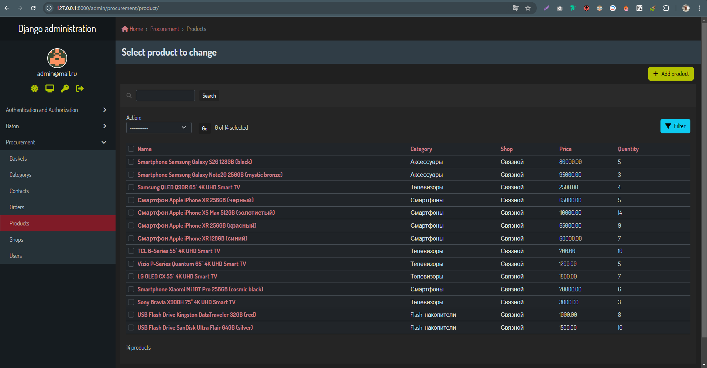

# Автоматизация закупок (дипломный проект, базовая часть)

## Описание проекта

Проект **Procurement Automation** - это система для автоматизации закупок, которая позволяет управлять магазинами, товарами, категориями, корзинами и заказами через Django. Также имеется административная панель для упрощённого взаимодействия с системой и API для интеграции с другими системами.

Проект включает в себя следующие возможности:

- Управление пользователями
- Загрузка товаров и категорий через YAML файлы
- Управление корзинами покупок и заказами
- Разработан с использованием Django и Django REST Framework

## Технологии

- **Django 5.x**: Основной фреймворк для построения приложения.
- **Django REST Framework (DRF)**: Для создания API.
- **SQLite**: Используется как база данных по умолчанию для разработки.
- **YAML**: Используется для загрузки прайс-листов.
- **Baton**: Улучшенная административная панель Django.

## Установка и настройка

1. **Клонируйте репозиторий:**

   ```bash
   git clone https://github.com/Alex-Easy/diploma_try_2.git
   cd diploma_try_2
   ```

2. **Создайте и активируйте виртуальное окружение:**

   Если у вас ещё нет виртуального окружения, создайте его с помощью:

   ```bash
   python -m venv .venv
   ```

   Затем активируйте его:

   - **Windows:**

     ```bash
     .venv\Scripts\activate
     ```

   - **Linux/MacOS:**

     ```bash
     source .venv/bin/activate
     ```

3. **Установите зависимости:**

   Установите все необходимые пакеты:

   ```bash
   pip install -r requirements.txt
   ```

4. **Настройка переменных окружения:**

   В корне проекта есть файл `.env.example` на основании него нужно создать файл `.env`:

   ```env
   SECRET_KEY=your-secret-key
   DEBUG=True
   DATABASE_URL=sqlite:///db.sqlite3
   ...
   ```

5. **Примените миграции:**

   Примените миграции для создания структуры базы данных:

   ```bash
   python manage.py migrate
   ```

6. **Создайте суперпользователя:**

   Для доступа к административной панели создайте суперпользователя:

   ```bash
   python manage.py createsuperuser
   ```

7. **Запустите сервер:**

   Для запуска сервера в режиме разработки выполните:

   ```bash
   python manage.py runserver
   ```

## Использование

### Админка Django

После запуска проекта, доступ к админке можно получить по адресу:

```
http://127.0.0.1:8000/admin/
```

Используйте данные для входа с суперпользователем.

### Загрузка прайс-листов

Для загрузки прайс-листов через админку, необходимо выбрать магазин в административной панели и использовать форму для загрузки файла YAML. В файле должны быть указаны:

- **shop**: Название магазина
- **categories**: Список категорий товаров
- **goods**: Список товаров с параметрами, ценами и количеством

Пример файла `shop1.yaml`:

```yaml
shop: Связной
categories:
  - id: 224
    name: Смартфоны
  - id: 15
    name: Аксессуары
goods:
  - id: 4216292
    category: 224
    name: Смартфон Apple iPhone XS Max
    price: 110000
    quantity: 10
```

### API

Проект предоставляет API для работы с магазинами, категориями, товарами, заказами и корзинами. Пример URL для получения списка товаров:

```
GET http://127.0.0.1:8000/api/v1/products/
```

Для работы с API необходимо использовать авторизацию через JWT. Получить токен можно с помощью POST запроса:

```
POST http://127.0.0.1:8000/api/v1/user/login/
```

## Тестирование

Для тестирования можно использовать Django тесты, которые уже настроены в проекте. Чтобы запустить тесты, выполните:

```bash
python manage.py test
```

## Заключение

Этот проект предназначен для автоматизации процессов закупок и управления ими. С помощью встроенной административной панели и API вы можете эффективно управлять всеми аспектами работы магазина, включая товары, заказы и пользователей.

## Скриншоты

### 1. Главная страница админки


### 2. Страница магазинов


### 3. Страница с каталогом товаров


### 4. Страница контакта


### 5. Страница заказа
